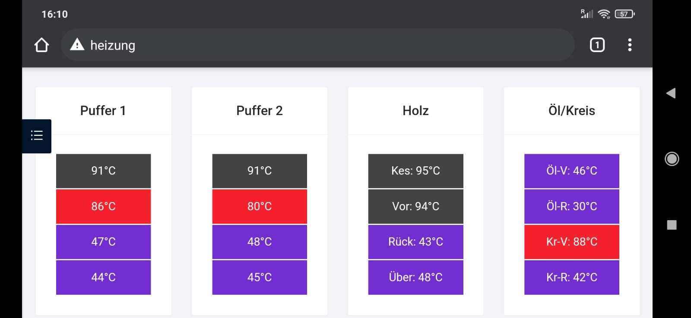

# Raspberry Pi Temperature Monitor

This project provides code to read temperature sensors and to display them in a neat and customizable web interface.
With this we can check our hybrid heating system (wood and oil) from everywhere and easily see if we need to put more wood on the fire.


## Requirements
* RaspberryPi, in my case with hostname `heizung`
* Installed webserver, I used nginx
* A few DS18B20 sensors
* A free weekend

## Project Structure

There are two folders in the project:
* **ui**: the react based website
* **backend**: scripts to read temperatur data

### UI (website)
A react based UI shows the temperature sensors for my heating system.
There are two buffers on the left and some other sensors for the two kettles and some pipes on the right.
They are color coded to instantly see if some temperatures are too high or too low.



### Backend

The backend is based on this awesome guide by Stefan Truppel: https://st-page.de/2018/01/20/tutorial-raspberry-pi-temperaturmessung-mit-ds18b20/

The script was modified to iterate over a set of sensors and prints a summary into the file `/var/www/html/sensors.json`.
This is then used for the website.

## Installation

### Getting Sensor Data

Modify `get_sensor.sh`, replace my sensors' IDs with yours.
As soon as you properly attached the sensors, you can find your sensors' IDs in folder `/sys/bus/w1/devices/`.
You can define the sensors' IDs to whatever you like, you just have to make sure the webui takes the proper values later.

Run the script once with `python3 get_sensors.sh`.
Once the script is started, it constantly checks for temperatures.

### Create a Service

Using `get_Sensors.py` you can build a service. 
Create the file `/etc/systemd/system/rpiheating.service` with this content:

```ini
[Unit]
Description=Pi Heating monitoring
After=network.target
StartLimitIntervalSec=0
[Service]
Type=simple
Restart=always
RestartSec=1
User=pi
ExecStart=/usr/bin/python /home/pi/rpiheating/backend/get_sensor.py

[Install]
WantedBy=multi-user.target
```

Start and enable the service with this:

```bash
systemctl start rpiheating
systemctl enable rpiheating
```

### Building the Webapp

First of all, install `node.js`, e.g., via `apt install nodejs` and give it a try.

```bash
npm install
npm audit fix
npm start
```

Build the optimized app with:

```bash
cd ui
npm run build
npm intall -g serve # only once
```

Copy the optimized build from `build/*` to `/var/www/html`.
Browse to http://heizung.

**Important**: If you changed the sensor IDs in the `get_sensors.py`, you have to modify them in the UI as well.

# Open Topics
* Put values into a database
* Implement statistics page